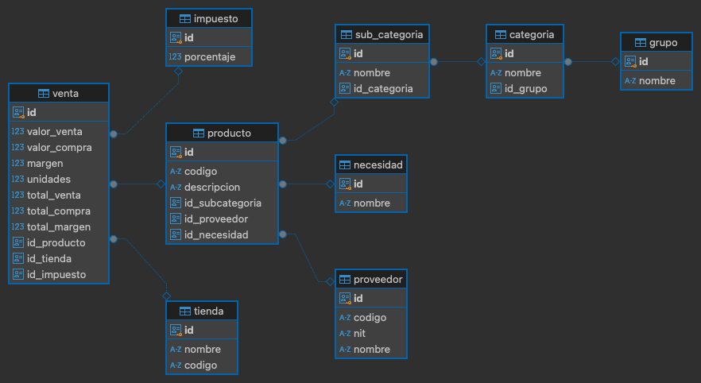

# Proyecto Final - Bases de Datos Empresariales

## Descripción General

Este proyecto final tiene como objetivo que los estudiantes exploren una base de datos empresarial proporcionada, generen consultas SQL avanzadas y presenten un informe gerencial con gráficos y análisis de negocio. El proyecto se desarrollará en equipos de 4, 5 o 6 personas.

## Introducción al Negocio

La empresa **ABC Retail** es una cadena de tiendas especializadas en la venta de productos de consumo masivo. La empresa opera a través de varias tiendas y trabaja con una amplia red de proveedores para ofrecer productos organizados en diversas categorías y subcategorías, tales como productos electrónicos, alimentos, ropa, entre otros. 

La gerencia de **ABC Retail** ha recolectado información sobre sus ventas, productos, impuestos, y proveedores en una base de datos relacional. Con el objetivo de mejorar la toma de decisiones estratégicas, la gerencia requiere un informe gerencial que destaque datos e insights clave para optimizar el rendimiento del negocio.

Este informe debe incluir análisis detallados de las ventas, márgenes, unidades vendidas, y el rendimiento de las tiendas, productos y categorías, entre otros aspectos. La información presentada permitirá a la gerencia tomar decisiones informadas sobre las estrategias comerciales, operaciones y posibles áreas de mejora dentro de la empresa.

### Fecha de entrega del informe
**31 de octubre a las 11:59 PM.**

## Instrucciones del Proyecto

El proyecto tiene **tres partes principales**:

1. **Documento de Queries (30% de la nota)**
   - Deben presentar un documento que incluya **todos los queries** que el equipo realizó.
   - Cada query debe estar acompañado de una **explicación detallada**: 
     - ¿Cómo funciona el query?
     - ¿Por qué decidieron hacerlo de esa manera?
   - La claridad y profundidad en las explicaciones son cruciales.

2. **Excel con Gráficas (30% de la nota)**
   - El Excel debe contener gráficas que representen información relevante para la gerencia.
   - El número de gráficas a entregar es libre, pero se evaluará la **calidad** de las mismas y **la profundidad de los análisis**.

3. **Análisis de Negocio (40% de la nota)**
   - El equipo debe generar un informe escrito para presentarlo a la gerencia.
   - El documento debe tener una introducción que explique el contexto del análisis.
   - Para cada gráfica, deben realizar un **análisis de negocio** que incluya:
     - ¿Qué información aporta la gráfica?
     - ¿Qué conclusiones se pueden obtener?
     - ¿Qué insights relevantes para la gerencia se pueden evidenciar en las gráficas?
     - Entre otras
   - El documento debe contener conclusiones relevantes.

### Preguntas Guía para el Análisis

Para ayudarles a orientar su análisis, pueden considerar, pero no limitarse, a las siguientes preguntas:
- ¿Qué categorías de productos tienen el margen más alto?
- ¿Qué tienda genera más ingresos?
- ¿Cuál es la relación entre el impuesto aplicado y las ventas?
- ¿Cuáles son los productos más vendidos y en qué tiendas?
- ¿Cómo varían las ventas según el grupo o necesidad de los productos?
- ¿Cuáles son los proveedores que más rotan?
- ¿Qué necesidades tienen márgenes más altos?
- ¿Cómo se comparan los diferentes proveedores dependiendo de la categoría de productos que venden?
- Entre otras

### Descripción de la Base de Datos

A continuación, se describe la estructura de las tablas y sus columnas:

#### Tabla: `grupo`
- **id**: Identificador único del grupo.
- **nombre**: Nombre del grupo.

#### Tabla: `impuesto`
- **id**: Identificador único del impuesto.
- **porcentaje**: Porcentaje del impuesto aplicado.

#### Tabla: `necesidad`
- **id**: Identificador único de la necesidad.
- **nombre**: Nombre de la necesidad.

#### Tabla: `proveedor`
- **id**: Identificador único del proveedor.
- **codigo**: Código del proveedor.
- **nit**: NIT del proveedor.
- **nombre**: Nombre del proveedor.

#### Tabla: `tienda`
- **id**: Identificador único de la tienda.
- **nombre**: Nombre de la tienda.
- **codigo**: Código de la tienda.

#### Tabla: `categoria`
- **id**: Identificador único de la categoría.
- **nombre**: Nombre de la categoría.
- **id_grupo**: Identificador del grupo al que pertenece.

#### Tabla: `sub_categoria`
- **id**: Identificador único de la subcategoría.
- **nombre**: Nombre de la subcategoría.
- **id_categoria**: Identificador de la categoría a la que pertenece.

#### Tabla: `producto`
- **id**: Identificador único del producto.
- **codigo**: Código del producto.
- **descripcion**: Descripción del producto.
- **id_subcategoria**: Identificador de la subcategoría.
- **id_proveedor**: Identificador del proveedor.
- **id_necesidad**: Identificador de la necesidad del producto.

#### Tabla: `venta`
- **id**: Identificador único de la venta.
- **valor_venta**: Valor unitario de la venta.
- **valor_compra**: Valor unitario de la compra.
- **margen**: Margen unitario de la venta.
- **unidades**: Número de unidades vendidas.
- **total_venta**: Total de la venta.
- **total_compra**: Total de la compra.
- **total_margen**: Total del margen.
- **id_producto**: Identificador del producto vendido.
- **id_tienda**: Identificador de la tienda donde se realizó la venta.
- **id_impuesto**: Identificador del impuesto aplicado.

### Diagrama Entidad-Relación

### Código DDL para creación de tablas
[DDL](./ddl.sql)

### Recomendación

Se sugiere que los estudiantes repliquen la estructura de esta base de datos en sus propios entornos, clonen los datos, y trabajen localmente en sus consultas y análisis. La base de datos proporcionada tiene permisos limitados, por lo que será más eficiente si tienen su propia instancia.

---

¡Buena suerte!
